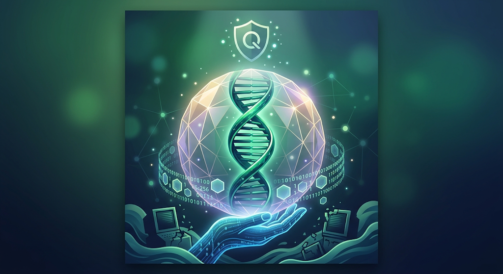

# Q-Shield Health

#### Post-Quantum Genomic Data Security Framework


-orange)


[Português](README.md) | [English](README.en.md) | [Español](README.es.md) | [中文](README.zh.md)

## Overview

O **Q-Shield Health** é um framework enterprise de segurança criptográfica projetado para proteger dados genômicos de alto rendimento (arquivos nos formatos FASTQ, BAM e VCF) contra ameaças de computação quântica. Utilizando o modelo de **Criptografia de Envelope Híbrida**, a solução combina a eficiência computacional do algoritmo simétrico **AES-256-GCM** com o algoritmo de encapsulamento de chaves pós-quântico **ML-KEM** (Module-Lattice-Based Key Encapsulation Mechanism, padronizado pelo NIST em FIPS 203).

### O que ele faz?

Imagine que o seu código genético (o DNA) é o livro de receitas mais importante e secreto sobre quem você é. Se esse livro cair em mãos erradas, alguém poderia ver todos os seus segredos de saúde!

#### Para proteger esse "livro", o projeto Q-Shield Health faz o seguinte:

Guarda o livro num cofre superforte: Ele tranca os dados do DNA usando um cadeado super-rápido (chamado AES-256).

Protege a chave do cofre contra computadores do futuro: No futuro, existirão "supercomputadores quânticos" capazes de quebrar quase todos os cadeados normais. Por isso, a chave desse cofre é guardada usando um enigma de matemática do futuro (o ML-KEM).

#### O que acontece nos testes?

Criou-se um arquivo de DNA falso, tranca ele no cofre pós-quântico e depois usa a chave secreta para abrir tudo de novo. No final, compara-se o arquivo antes e depois de trancar: ele voltou 100% perfeito, sem perder uma única letra!



## Ameaça Quântica vs. Dados Genômicos

Arquivos genômicos contêm as informações mais sensíveis e imutáveis de um indivíduo e de sua linhagem biológica. O advento de computadores quânticos de escala relevante (CRQC - Cryptographically Relevant Quantum Computer) executando o Algoritmo de Shor tornará vulneráveis os sistemas de chave pública tradicionais (RSA, ECC, Diffie-Hellman).

Adversários estão aplicando a estratégia **Harvest-Now, Decrypt-Later (HNDL)**, interceptando e armazenando dados genômicos cifrados na atualidade para decifrá-los assim que o hardware quântico estiver operacional. O Q-Shield Health neutraliza esse vetor de ataque garantindo confidencialidade pós-quântica imediata.

### Arquitetura do Envelope (ML-KEM + AES)

A solução não cifra o arquivo genômico diretamente com algoritmos pós-quânticos devido a restrições severas de tamanho e performance das estruturas de reticulados. Em vez disso, aplica-se o modelo de envelope:

1. **Data Level Encryption**: O payload genômico é cifrado via streaming utilizando uma Chave de Criptografia de Dados simétrica efêmera (DEK - 256 bits) com AES-256-GCM.
2. **Key Level Encapsulation**: A DEK é encapsulada através da Chave Pública do destinatário usando ML-KEM-768/1024, gerando um Ciphertext KEK (Key Encryption Key).
3. **Storage Container**: O arquivo resultante (.qgh) une o cabeçalho binário estruturado (contendo a KEK cifrada e parâmetros) ao stream cifrado.

### Quickstart (Instalação via `uv`)

O projeto utiliza o gerenciador de pacotes de alta performance `uv`.

### Pré-requisitos
- Python 3.12 ou superior
- Gerenciador `uv` instalado

```bash
# Clonar o repositório
git clone [https://github.com/Area-41/q-shield-health.git](https://github.com/Area-41/q-shield-health.git)
cd q-shield-health

# Criar ambiente virtual e instalar dependências
uv venv
source .venv/bin/activate
uv pip install -e .