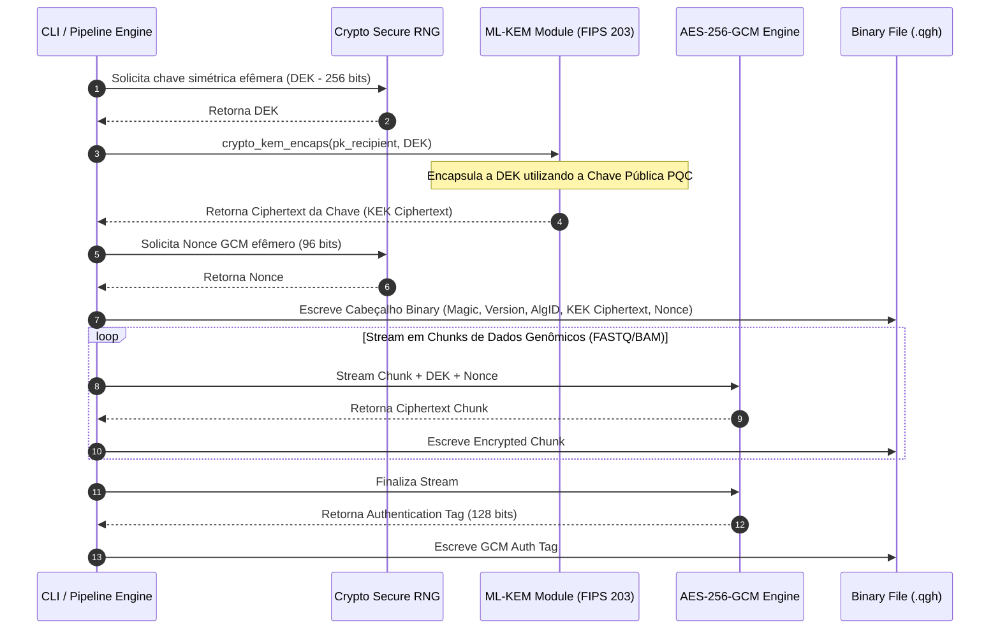
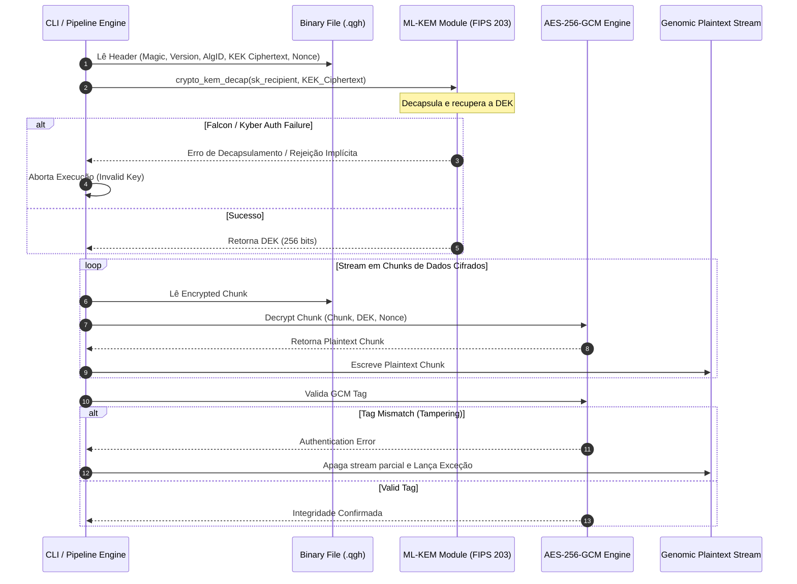

# Q-Shield Health: Technical Architecture Specification

## Overview

Q-Shield Health implements a **Hybrid Envelope Encryption Architecture** optimized for high-throughput genomic data files (FASTQ, BAM, VCF). 

By decoupling data encryption from key encapsulation, the architecture delivers constant quantum-resistant overhead regardless of file size (from MBs to TBs).

## Core Components

1. **Ingestion Layer**: Reads large binary/text streams from genomic sequencers using a chunked buffer strategy (`CHUNK_SIZE = 64MB`).
2. **Key Encapsulation Mechanism (KEM)**: Uses **ML-KEM-768 / ML-KEM-1024** (NIST FIPS 203) to encapsulate a 256-bit ephemeral Data Encryption Key (DEK).
3. **Symmetric Data Cipher**: Uses **AES-256-GCM** (Galois/Counter Mode) providing authenticated encryption (AEAD) over genomic chunks.
4. **Binary Container (.qgh)**: Custom binary layout containing protocol metadata, encrypted KEK ciphertext, initialization vector (nonce), and authenticated payload chunks.

## Binary Container Layout (.qgh)

```text
+-------------------+-----------------+-------------------+
| Magic Bytes (4B)  | Version (1B)    | Alg ID (1B)       |
+-------------------+-----------------+-------------------+
| KEK Length (2B)   | KEK Ciphertext (Var: 1088B/1568B)   |
+-------------------+-----------------+-------------------+
| GCM Nonce (12B)   | Encrypted Payload Streams...      |
+-------------------+-------------------------------------+



